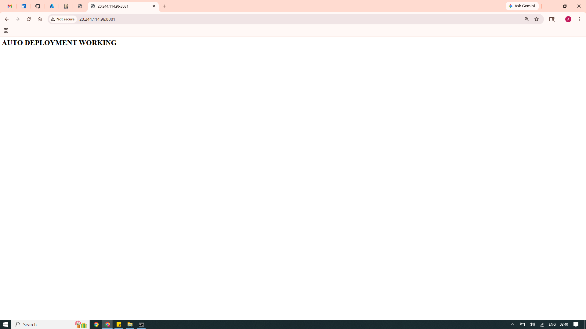
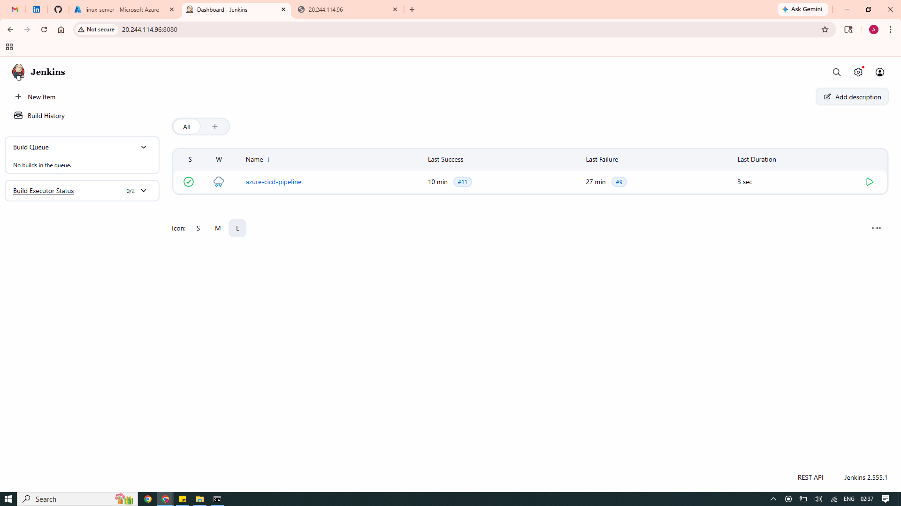
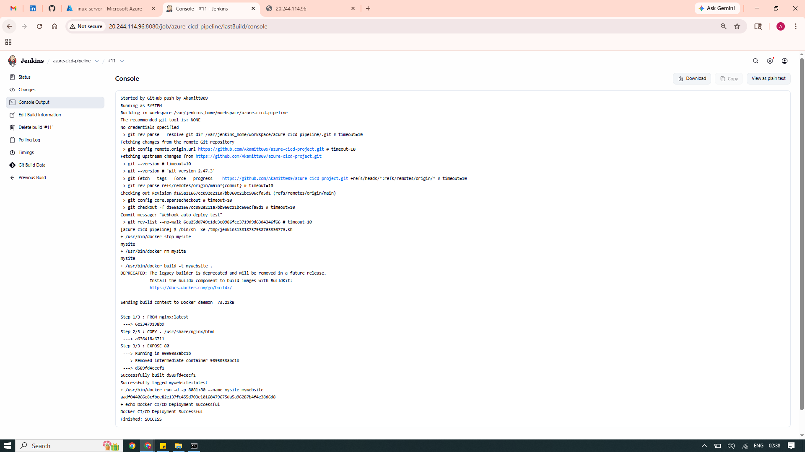
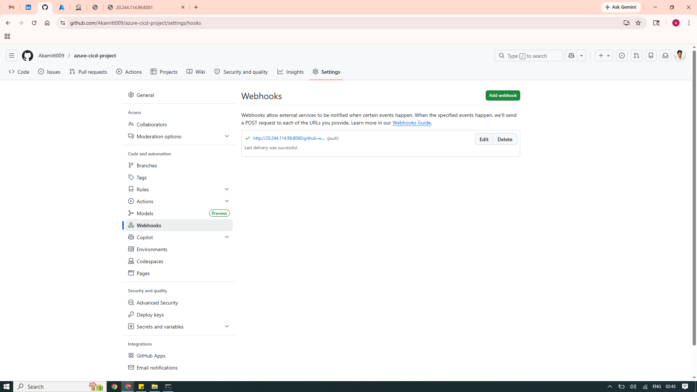
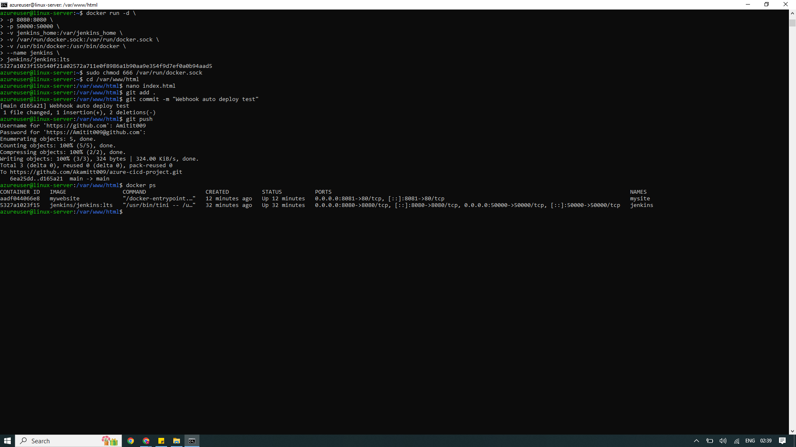
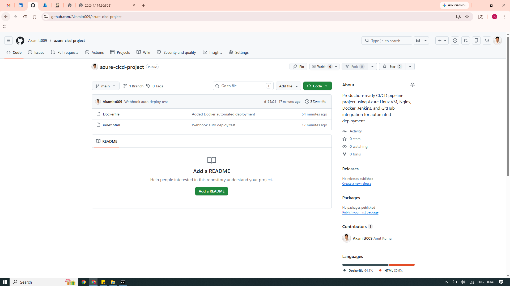

# 🚀 Enterprise Azure CI/CD Pipeline with Docker & Jenkins Automation

## 📌 Project Overview

This project demonstrates a complete production-style CI/CD pipeline implementation using Microsoft Azure, Docker, Jenkins, and GitHub Webhooks for automated application deployment.

The environment was designed to simulate a real-world DevOps workflow where every code push to GitHub automatically triggers a Jenkins pipeline that rebuilds and redeploys the application inside a Docker container without any manual deployment steps.

The project focuses on automation, containerization, deployment troubleshooting, and real-time continuous delivery workflows commonly used in enterprise cloud environments.

---

# 🧑‍💼 Business Requirement

The objective was to design an automated deployment system capable of:

- Eliminating manual deployment processes
- Automatically deploying application updates after GitHub pushes
- Supporting containerized deployments
- Reducing deployment time
- Simulating real-world CI/CD operations
- Hosting applications on Azure cloud infrastructure

---

# 🏗️ CI/CD Workflow Architecture

```text
Developer Pushes Code to GitHub
              ↓
GitHub Webhook Trigger
              ↓
Jenkins Pipeline Starts Automatically
              ↓
Docker Image Build Process
              ↓
Old Docker Container Removed
              ↓
New Container Deployed
              ↓
Application Updated Automatically
````

---

# ⚙️ Technologies Used

| Technology      | Purpose                    |
| --------------- | -------------------------- |
| Microsoft Azure | Cloud Infrastructure       |
| Ubuntu Linux VM | Application Hosting        |
| Jenkins         | CI/CD Automation           |
| Docker          | Containerization           |
| GitHub          | Source Code Management     |
| GitHub Webhooks | Automated Pipeline Trigger |
| Nginx           | Web Server                 |
| Linux Commands  | System Administration      |

---

# 🔥 Key Features

✅ Automated CI/CD Pipeline
✅ GitHub Webhook Integration
✅ Dockerized Application Deployment
✅ Jenkins Auto Build Trigger
✅ Azure VM Hosting
✅ Zero Manual Deployment
✅ Real-Time Continuous Delivery
✅ Production-Style DevOps Workflow
✅ Container Lifecycle Automation
✅ Linux-Based Infrastructure Deployment

---

# 📂 Project Structure

```text
azure-cicd-project/
│
├── Dockerfile
├── Jenkinsfile
├── index.html
├── README.md
│
└── images/
    ├── auto-deployment-working.PNG
    ├── azure-vm-terminal.PNG
    ├── github-repository.PNG
    ├── github-webhook-success.PNG
    ├── jenkins-build-output.PNG
    └── jenkins-dashboard.PNG
```

---

# 🛠️ Implementation Process

---

## 1️⃣ Azure Infrastructure Deployment

* Created Ubuntu Linux Virtual Machine on Microsoft Azure
* Configured networking and external access
* Opened required inbound ports:

| Port  | Purpose                     |
| ----- | --------------------------- |
| 22    | SSH Access                  |
| 8080  | Jenkins Dashboard           |
| 8081  | Application Access          |
| 50000 | Jenkins Agent Communication |

---

## 2️⃣ Jenkins Setup & Configuration

* Installed Jenkins inside Docker container
* Configured Jenkins dashboard
* Created CI/CD freestyle pipeline job
* Enabled automated GitHub integration

---

## 3️⃣ Docker Configuration

* Installed Docker on Azure Linux VM
* Configured Docker permissions
* Built application deployment container
* Automated container lifecycle management

---

## 4️⃣ GitHub Webhook Integration

* Connected GitHub repository with Jenkins
* Configured webhook trigger events
* Enabled automatic build execution after every push

---

## 5️⃣ Automated Deployment Workflow

Configured deployment automation commands:

```bash
docker stop mysite || true
docker rm mysite || true
docker build -t mywebsite .
docker run -d -p 8081:80 --name mysite mywebsite
```

This workflow automatically:

* Stops old container
* Removes existing deployment
* Builds updated Docker image
* Deploys latest application version

---

# ⚠️ Challenges Faced & Solutions

---

## ❌ Issue 1: `sudo: not found`

### Cause

Jenkins container environment did not support sudo commands.

### Solution

Removed sudo usage from deployment commands and executed commands directly inside the container environment.

---

## ❌ Issue 2: Docker Permission Denied

### Error

```bash
permission denied while trying to connect to docker.sock
```

### Cause

Jenkins container lacked access to Docker daemon socket.

### Solution

Mounted Docker socket and Docker binary inside Jenkins container:

```bash
-v /var/run/docker.sock:/var/run/docker.sock
-v /usr/bin/docker:/usr/bin/docker
```

Updated Docker socket permissions:

```bash
sudo chmod 666 /var/run/docker.sock
```

---

## ❌ Issue 3: Docker Command Not Found

### Cause

Docker binary was unavailable inside Jenkins container environment.

### Solution

Mapped Docker binary from host VM into Jenkins container for Docker command accessibility.

---

# 📸 Project Screenshots

---

## 🔹 Automated Deployment Working



Demonstrates successful automatic deployment after GitHub push trigger.

---

## 🔹 Jenkins Dashboard



Configured Jenkins CI/CD dashboard responsible for deployment automation.

---

## 🔹 Successful Jenkins Build Output



Shows successful pipeline execution and Docker deployment process.

---

## 🔹 GitHub Webhook Integration



GitHub webhook successfully triggering Jenkins automatically after repository updates.

---

## 🔹 Azure VM Terminal Configuration



Azure Linux VM setup and Docker/Jenkins configuration environment.

---

## 🔹 GitHub Repository Structure



Project source code and deployment files hosted on GitHub.

---

# 🌐 Live Deployment

Application successfully deployed on Azure Linux VM using Docker containerization and Jenkins automation.

## 🔗 Live URL

```text
http://20.244.114.96:8081
```

---

# 📈 Project Outcome

Successfully designed and implemented a fully automated enterprise-style CI/CD deployment pipeline on Microsoft Azure.

The environment supports:

* Automatic deployment after GitHub push
* Docker-based application delivery
* Jenkins pipeline automation
* Continuous deployment workflow
* Real-time application updates
* Container lifecycle management
* Production-style DevOps operations

---

# 🧠 Technical Skills Demonstrated

* Microsoft Azure Administration
* Linux Server Administration
* Docker Containerization
* Jenkins Automation
* CI/CD Pipeline Design
* GitHub Webhook Integration
* Deployment Automation
* Troubleshooting & Debugging
* DevOps Workflow Implementation
* Cloud Infrastructure Management

---

# 👨‍💻 Author

## Amit Kumar

Azure Administrator | DevOps Enthusiast | Cloud Infrastructure Engineer

### 🔗 Connect With Me

* LinkedIn: [https://www.linkedin.com/in/amit-kumar-657255232/](https://www.linkedin.com/in/amit-kumar-657255232/)
* GitHub: [https://github.com/Akamitt009](https://github.com/Akamitt009)

```
```
